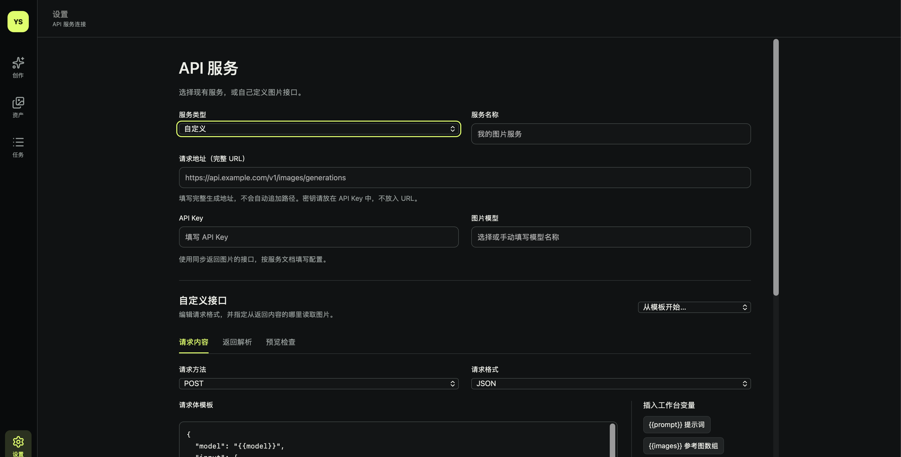

<div align="center">

# 电商模特图 Studio · Product Image Workbench

**中文：** 从本地商品资产、结构化参考到可追踪的多服务生图工作台。<br>
**English:** A local workbench for turning product assets and structured references into traceable image-generation tasks.

[](https://nodejs.org/)
[](https://www.sqlite.org/)
[](https://platform.openai.com/docs/api-reference)
[](https://help.aliyun.com/zh/model-studio/)

</div>

## 项目概览 · Overview

中文：导入并整理本地商品图片，选择比例、尺寸和结构化引用，提交到兼容的图像服务；工作台保留资产、请求、任务时间线和生成结果，便于回溯与下载。服务适配器覆盖 OpenAI 兼容接口、阿里云 DashScope 原生接口和可配置的自定义 JSON/multipart 请求。

English: Import local product assets, compose structured references, and send image tasks through provider adapters. The workbench keeps assets, requests, task timelines, and results together for review and download.

## 工作台截图 · Screenshots

> Screenshots are placeholders for the showcase. **Redact API keys, customer data, and other secrets before committing screenshots.**

| 工作台 · Workbench | 结果 · Results | 设置 · Settings |
| --- | --- | --- |
|  |  |  |

## 核心能力 · Core capabilities

The workbench combines local asset management, structured image references, traceable tasks, and adaptable provider integrations.

- **资产库 · Asset library** — 分类、标签、筛选、缩略图与本地原图管理。
- **结构化引用 · Structured references** — 通过 `@` 引用资产，限制参考图并组合提示词。
- **任务时间线 · Task timeline** — 查看请求状态、关联重试、结果溯源与下载。
- **服务适配器 · Provider adapters** — OpenAI-compatible、DashScope 原生和自定义 JSON/multipart 模板。

## 工程亮点 · Engineering highlights

Requests are bounded and durable: the queue controls concurrency while persistence and explicit states preserve what happened across retries or disconnects.

- 每次请求生成一张图片，最多同时执行 **2** 个图像请求，其余进入队列。
- 支持取消、重试和关联任务；取消只停止本地等待，不能保证上游停止计费。
- 连接断开后标记为 **结果未知**，不会擅自当作上游失败；当前同步接口无法找回断线后的上游结果。
- 任务、资产和标签持久化到 SQLite；服务重启会将未完成任务标记为中断，可手动重试。
- 自定义适配器支持 JSON 或 multipart 请求体、请求头变量、图片编码、参考图限制、尺寸分隔符和返回图片字段路径；不执行用户脚本。

## 快速开始 · Quick start

需要 Node.js **22.13 或更高版本**。

Install dependencies, start the local server, and open the workbench in your browser.

```sh
npm install
npm start
```

打开 <http://127.0.0.1:64220>。默认服务只监听本机。

## 项目文档 · Project docs

Planning and demo references live in the following project documents.

- [自定义 API 计划 · Custom API plan](docs/custom-api-plan.md)
- [演示计划 · Demo plan](docs/demo-plan.md)
- [截图目录 · Screenshots](docs/screenshots)

## 安全说明 · Safety notes

Keep credentials and generated data local, and use the application only inside a trusted network boundary.

- API Key 保存在本地 `data/api-settings.json`；请勿分享或提交该文件。
- `data/` 不应提交到版本库。备份时停止服务并复制整个 `data/` 目录。
- 当前版本没有账号或访问控制；不要把服务直接暴露到公网。

## 当前边界 · Current boundaries

Provider behavior depends on the selected upstream service and the capabilities implemented by each adapter.

- 服务账单、模型质量和接口兼容性必须使用你选择的模型与账户自行验收。
- 自定义适配器暂不支持需要任务 ID 轮询的 API。
- 其它服务的尺寸能力不会被猜测；以适配器和上游服务实际支持为准。
